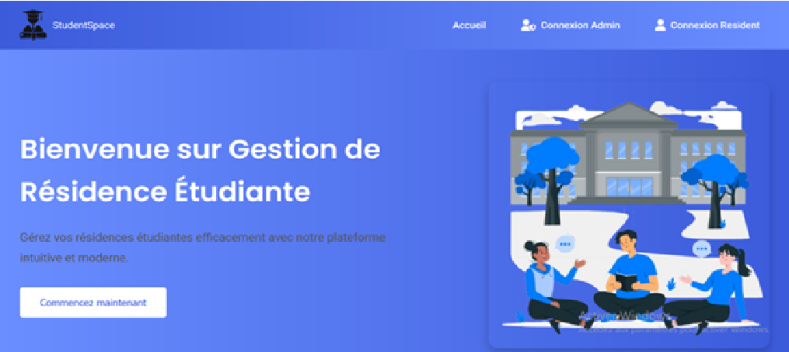
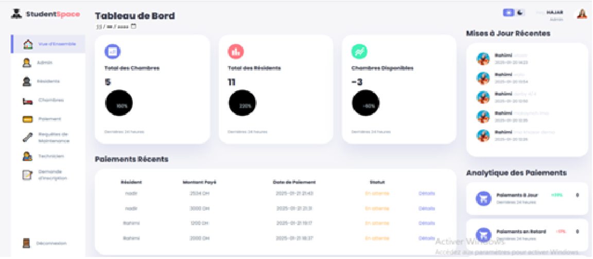
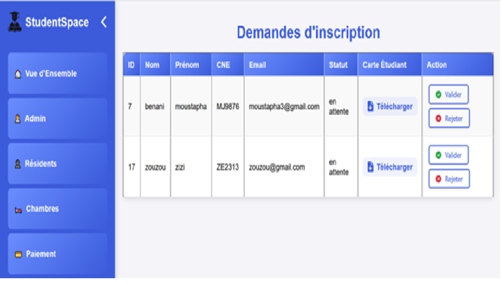
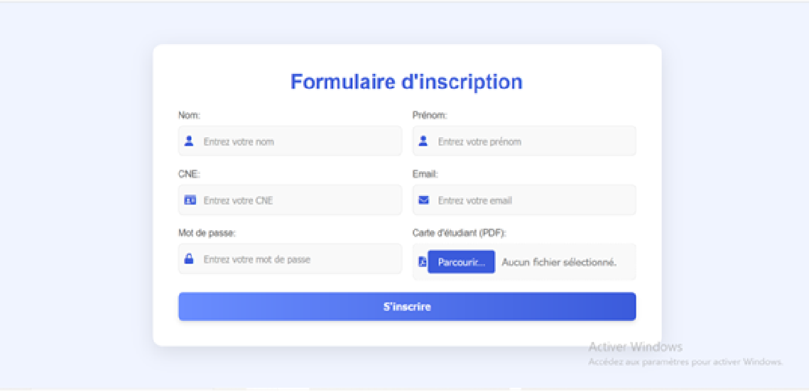
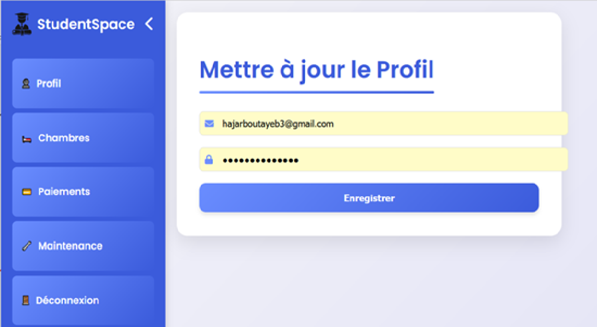
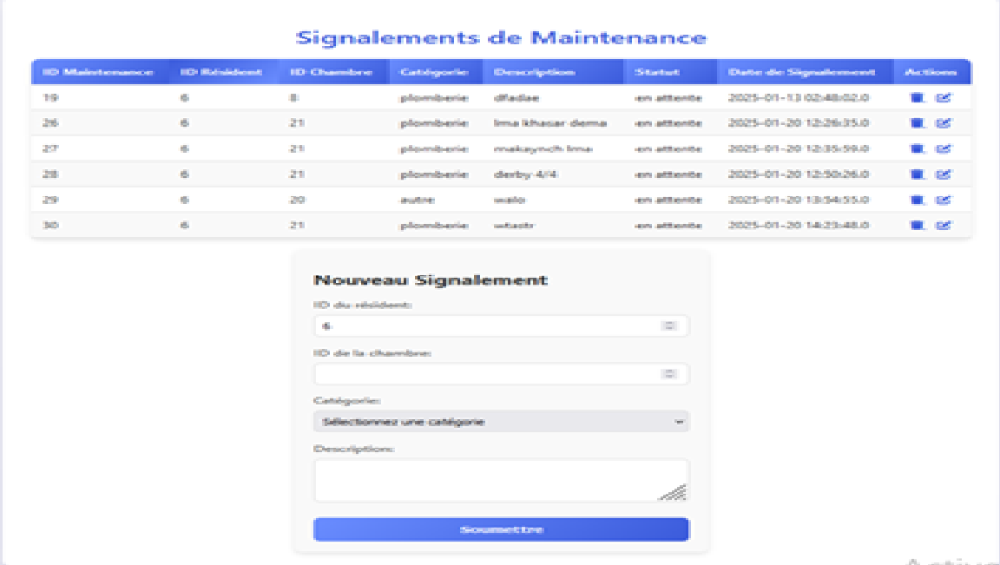

# 📘 Application Web de Gestion des Résidences Étudiantes


---

## 📝 Description

Ce projet est une **application web Java EE (JSP/Servlets)** développée dans le cadre du cursus universitaire à la  
**Faculté des Sciences Ben M’Sik – Université Hassan II de Casablanca**.

Elle vise à **automatiser la gestion des résidences étudiantes**, en offrant deux principales interfaces :

* **Interface Administrateur** : gestion des chambres, des résidents, des paiements, des requêtes de maintenance, des techniciens et des statistiques globales.  
* **Interface Résident** : gestion du profil, suivi des paiements, soumission et suivi des requêtes de maintenance.

L’objectif est d’assurer une **gestion centralisée, efficace et transparente** des opérations liées à la résidence universitaire.

---

## 🚀 Fonctionnalités

### 👩‍💼 Côté Administrateur :
* 🏠 **Gestion des chambres** : ajout, modification, suppression, visualisation de la disponibilité.  
* 👩‍🎓 **Gestion des résidents** : validation des préinscriptions, attribution des chambres, mise à jour des données.  
* 💳 **Gestion des paiements** : suivi des statuts (payé, en retard, en attente), envoi de rappels, génération de **reçus PDF**.  
* 🔧 **Gestion des requêtes de maintenance** : attribution de techniciens, suivi du statut.  
* 👷 **Gestion des techniciens** : ajout, modification, activation/désactivation.  
* 📊 **Tableau de bord** : visualisation des statistiques générales.

### 🧑‍🎓 Côté Résident :
* 👤 **Préinscription** et connexion sécurisée.  
* 🛏️ **Réservation** : consultation et soumission de demandes.  
* 💰 **Paiements** : historique et téléchargement de reçus.  
* 🛠️ **Maintenance** : soumission et suivi des requêtes.

---

## 🛠️ Technologies utilisées

* **Back-end** : Java EE (Servlets, JSP)  
* **Serveur** : Apache Tomcat 9 / 10  
* **Base de données** : MySQL 8.0  
* **Front-end** : HTML5, CSS3, JavaScript  
* **Bibliothèques** : JDBC, iTextPDF  

---

## 📂 Structure du projet

```bash
GestionResidenceUniversitaire/
│── src/                  # Code source Java (Models, DAO, Controllers)
│── webapp/               # JSP, CSS, JS, Images
│── WEB-INF/              # Fichier de configuration web.xml
│── database/             # Scripts SQL
│── docs/                 # Documentation & UML
│── screenshots/          # Captures d’écran
└── README.md             # Description du projet

⚙️ Installation et Exécution

Cloner le projet
git clone [https://github.com/HajarBoutayeb/GestionResidenceUniversitaire.git]

Configuration

Ouvrez le projet dans IntelliJ IDEA ou Eclipse.

Créez la base de données residence_db et importez le fichier SQL.

Configurez les identifiants dans DBConnection.java.

Lancement

Déployez sur Apache Tomcat.

URL : http://localhost:8080/GestionResidenceUniversitaire

## 📊 Screenshots







---

📖 Documentation

📑 Spécifications et cahier des charges

📐 Diagrammes UML (cas d’utilisation, classes, séquences)

🧠 Conception et implémentation du système

🧭 Manuel d’utilisation (facultatif)

## 👩‍💻 Auteure

**Hajar Boutayeb**  
📧 Email : hajarboutayeb3@gmail.com  
🔗 LinkedIn : https://www.linkedin.com/in/hajar-boutayeb-25bb90303/
